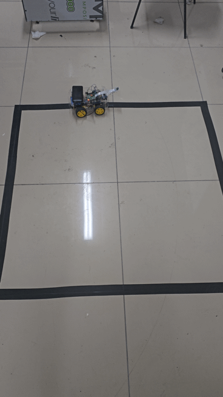

# Line Following and Intersection Detection Robot using Raspberry Pi

This project uses a Raspberry Pi and PiCamera to follow a black line on the ground and detect intersections. Based on the detected intersection count, the robot executes predefined movements (e.g., go straight, turn left, stop) using a PID control system.

## 🔧 Features

- Real-time video processing using PiCamera
- Black line detection and tracking
- Intersection detection based on line width
- Predefined path control (left, right, straight, stop)
- PID control for smooth line following

## 📦 Hardware Requirements

- Raspberry Pi (3 or 4)
- PiCamera
- 2 DC motors
- Motor driver (e.g., L298N, BTS7960)
- Robot chassis with black line track

## 📌 GPIO Pin Configuration

| Motor Action     | GPIO Pin |
|------------------|----------|
| Right Forward    | 26       |
| Right Backward   | 6        |
| Left Forward     | 5        |
| Left Backward    | 19       |

## 🚀 Installation

1. Update packages and install dependencies:
   ```bash
   sudo apt update
   sudo apt install python3-opencv python3-picamera


2. Run the program with root privileges:

   ```bash
   sudo python3 main.py
   ```

## 🧠 How It Works

* Captures frames from the PiCamera.
* Converts the frame to grayscale and applies binary thresholding.
* Detects black contours using `cv2.findContours`.
* Identifies the largest black region and calculates its center and angle.
* Applies PID control based on line position and angle to adjust motor speeds.
* Detects intersections when line width exceeds a threshold and reacts accordingly.

## 🗺 Path Definition

The robot follows a predefined route based on the number of detected intersections:

```python
rota = {
    1: "straight",
    2: "left",
    3: "left",
    4: "stop"
}
```

* 1st intersection → go straight
* 2nd intersection → turn left
* 3rd intersection → turn left
* 4th intersection → stop

## ⚙️ PID Parameters

```python
Kp = 0.35
Ki = 0.001
Kd = 0.09
K_ang = 0.3
```

You can tune these values to better match your robot's behavior and environment.

## 🎞 Demo



## 🎮 Controls

* Press `q` to quit the program.

## ⚠️ Notes

* Ensure the robot is placed on a surface with high contrast black lines.
* The robot stops and GPIO pins are safely cleaned up at the end of execution.

## 🖼 Screenshots

| Window               | Description                           |
| -------------------- | ------------------------------------- |
| `Binary`             | Thresholded binary image of the frame |
| `Original with line` | Original image with drawn contours    |
